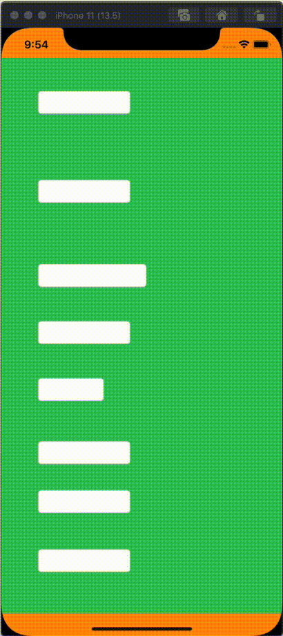

# Synopsis:

This class scrolls the screen upwards when the virtual keyboard is shown so that it doesn't cover the actual text field. 

# Description:

There are many solutions to the annoying problem of having the virtual keyboard cover the currently focused UITextField. I've seen some use a good universal implementation like IQKeyboardManager, https://github.com/hackiftekhar/IQKeyboardManager 
BUT they are not updated for use with or without Autolayout or other issues. 
This solution is fairly simple and adds a UIScrollView between your UIView and it's superview automatically. Sometimes simple is best. It works for views that use Autolayout constraints or just plain resizing masks. 

# How to use:

1. Create an instance of KeyboardHelper. 

<code>let keyboardHelper = KeyboardHelper()</code>

2. Add it to the superview of the UITextField or the view you wish to be scrolled up.  

<code>keyboardHelper.addTo(view: content)</code>

Optionally:  add your code in for the keyboard events

<code>
onKeyboardWillBeShown

onKeyboardWillBeResized

onKeyboardWillBeHidden

</code>

See the demo project KeybpoardDemo for an example. 

How it works:

